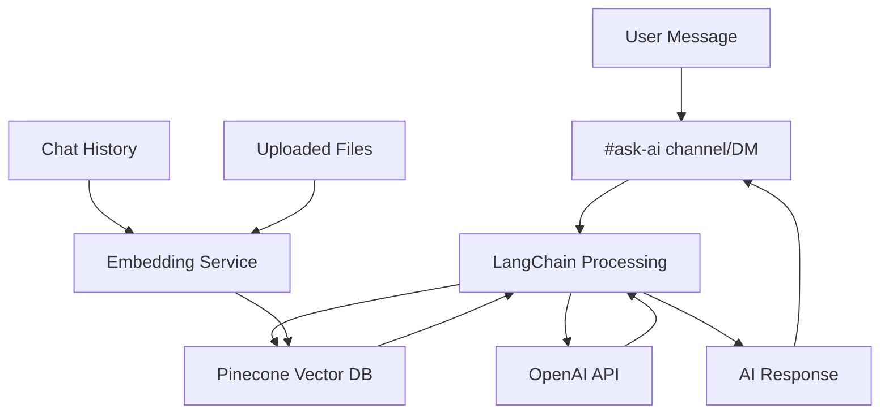

# ChatGenius AI Integration Guide

## Table of Contents
1. [Part 1 - Overview and Architecture](#part-1---overview-and-architecture)
2. [Part 2 - Understanding Technical Concepts](#part-2---understanding-technical-concepts)
3. [Part 3 - Step-by-Step Implementation Guide](#part-3---implementation-guide)
4. [Part 4 - Meeting Project Requirements](#part-4---meeting-project-requirements)
5. [Part 5 - Changes and Updates Summary](#part-5---changes-and-updates-summary)

## Part 1 - Overview and Architecture

### What We're Building

We're adding an AI assistant to ChatGenius that can:
1. Monitor and understand conversations across all channels
2. Answer questions about past conversations using RAG
3. Provide insights and summaries
4. Access and reference shared files
5. Act as a persona when users are unavailable

The AI will be available through:
1. A dedicated "#ask-ai" channel for general queries
2. Direct Messages for personal assistance
3. Thread responses for contextual help

### System Architecture



### Integration Points

1. **Message Processing:**
   - Messages stored in Supabase (using existing `handleSendMessage` in `Index.tsx`)
   - Embeddings created via LangChain (similar to `upload.py` in workspace examples)
   - Vectors stored in Pinecone (following RAG pattern)

2. **AI Channel:**
   - Special handling for #ask-ai channel
   - RAG-powered responses
   - Access to full conversation context

3. **Vector Search:**
   - Using LangChain's similarity search (as shown in `similarity_search.ipynb`)
   - Semantic understanding of context
   - File content searching

### Technical Stack

1. **Core Components** (from our `requirements.txt`):
   ```
   langchain==0.2.15
   langchain-openai==0.1.23
   langchain-pinecone==0.1.3
   pinecone-client==5.0.1
   openai==1.43.0
   ```

2. **Existing App Stack** (from `README.md`):
   ```
   - Vite
   - TypeScript
   - React
   - shadcn-ui
   - Tailwind CSS
   ```

[Continue to Part 2 →](#part-2---understanding-technical-concepts)

## Part 2 - Understanding Technical Concepts

### Breaking Down RAG Implementation

RAG (Retrieval-Augmented Generation) is central to our implementation. Looking at our workspace examples:

1. **Document Processing** (from `upload.py`):
```python
# This is how we'll process our chat messages
text_splitter = RecursiveCharacterTextSplitter(chunk_size=1000, chunk_overlap=100)
documents = text_splitter.split_documents(raw_docs)
```

2. **Embedding Creation** (using LangChain):
```python
# We'll use this same approach for chat messages
embeddings = OpenAIEmbeddings(model="text-embedding-3-large")
PineconeVectorStore.from_documents(documents=documents, embedding=embeddings)
```

3. **Similarity Search** (from `similarity_search.ipynb`):
```python
# This shows how we'll find relevant messages
docs_and_scores = db.similarity_search_with_score(query)
```

### LangChain Integration

LangChain provides several key components we'll use:

1. **Text Splitters**
   - Breaks long messages into chunks
   - Maintains context windows
   - Handles overlap for better context

2. **Embeddings**
   - Creates vector representations
   - Manages OpenAI API calls
   - Handles batching

3. **Vector Store**
   - Integrates with Pinecone
   - Manages similarity search
   - Handles metadata

### API Implementation

Looking at our existing code and Ash's examples:

1. **Route Structure**:
```typescript
// We'll add this to our existing API routes
app.post("/api/ask-ai", async (req, res) => {
  const question = req.body.question;
  const answer = await aiHandler.processQuestion(question);
  res.json({ response: answer });
});
```

2. **Vector Search**:
```python
# From RAG_fusion_101.ipynb - we'll adapt this
vectorStore = await PineconeStore.fromExistingIndex(
  new OpenAIEmbeddings(),
  { pineconeIndex }
);
```

[Continue to Part 3 →](#part-3---implementation-guide)

## Part 3 - Step-by-Step Implementation Guide

### Phase 1: LangChain and RAG Setup

1. **Install Dependencies**
   ```bash
   npm install langchain @pinecone-database/pinecone openai
   ```

2. **Initialize LangChain Components**
   ```typescript
   import { OpenAI } from 'langchain/llms/openai';
   import { PineconeStore } from 'langchain/vectorstores/pinecone';
   import { OpenAIEmbeddings } from 'langchain/embeddings/openai';
   
   // Initialize LangChain with our existing OpenAI key
   const llm = new OpenAI({
     temperature: 0.7,
     modelName: 'gpt-4',
   });
   ```

3. **Set Up Message Processing**
   ```typescript
   import { RecursiveCharacterTextSplitter } from 'langchain/text_splitter';
   
   const textSplitter = new RecursiveCharacterTextSplitter({
     chunkSize: 1000,
     chunkOverlap: 100,
   });
   ```

### Phase 2: Vector Database Integration

1. **Initialize Pinecone**
   ```typescript
   import { PineconeClient } from '@pinecone-database/pinecone';
   
   const pinecone = new PineconeClient();
   await pinecone.init({
     apiKey: process.env.PINECONE_API_KEY,
     environment: process.env.PINECONE_ENVIRONMENT,
   });
   ```

2. **Create Embedding Service**
   ```typescript
   class MessageEmbeddingService {
     private embeddings: OpenAIEmbeddings;
     private vectorStore: PineconeStore;
     
     constructor() {
       this.embeddings = new OpenAIEmbeddings();
       // Initialize vector store
     }
     
     async embedMessage(message: Message) {
       const texts = await textSplitter.splitText(message.content);
       return await this.vectorStore.addDocuments(texts.map(text => ({
         pageContent: text,
         metadata: {
           messageId: message.id,
           channelId: message.channelId,
           timestamp: message.createdAt,
         }
       })));
     }
   }
   ```

### Phase 3: RAG Implementation

1. **Create RAG Service**
   ```typescript
   class RAGService {
     private vectorStore: PineconeStore;
     private llm: OpenAI;
     
     async processQuery(query: string) {
       // Get relevant documents
       const docs = await this.vectorStore.similaritySearch(query, 5);
       
       // Format context
       const context = docs.map(doc => doc.pageContent).join('\n');
       
       // Generate response
       const response = await this.llm.predict(
         `Context: ${context}\n\nQuestion: ${query}`
       );
       
       return response;
     }
   }
   ```

2. **Implement API Route**
   ```typescript
   import { RAGService } from '../services/rag';
   
   export default async function handler(req: NextApiRequest, res: NextApiResponse) {
     const ragService = new RAGService();
     const response = await ragService.processQuery(req.body.question);
     res.json({ answer: response });
   }
   ```

[Continue to Part 4 →](#part-4---meeting-project-requirements)

## Part 4 - Meeting Project Requirements

### Project Success Criteria Analysis

Based on Ash's requirements, we need to implement one or more of these AI components:

1. **Persona AI (When User is Unavailable)**
   ```typescript
   class PersonaAI extends RAGService {
     private userPreferences: UserSettings;
     
     async respondAsUser(message: Message) {
       // Get user's past messages for context
       const userHistory = await this.vectorStore.similaritySearch(
         message.content,
         { filter: { userId: this.userPreferences.id }}
       );
       
       // Generate persona-based response
       return this.generatePersonaResponse(message, userHistory);
     }
   }
   ```

2. **Workspace-Wide RAG System**
   - Already implemented in our base design
   - Uses `similarity_search.ipynb` approach from workspace examples
   - Integrates with existing message storage

3. **Document-Based RAG**
   ```typescript
   class DocumentRAG extends RAGService {
     async queryDocuments(query: string, fileTypes: string[] = []) {
       // Use upload.py approach for document processing
       const relevantDocs = await this.vectorStore.similaritySearch(query, {
         filter: { fileType: { $in: fileTypes }}
       });
       
       return this.generateDocumentResponse(query, relevantDocs);
     }
   }
   ```

### Implementation Strategy

We're implementing all three components, prioritized as follows:

1. **Primary: Workspace-Wide RAG**
   - Leverages existing message infrastructure
   - Uses LangChain components from workspace examples
   - Follows RAG_fusion_101.ipynb patterns

2. **Secondary: Document RAG**
   - Extends primary RAG implementation
   - Reuses upload.py processing logic
   - Adds file type filtering

3. **Tertiary: Persona AI**
   - Builds on RAG foundation
   - Adds user-specific context
   - Implements availability checking

### Integration with Existing Features

1. **Channels & DMs**
   ```typescript
   // In Index.tsx handleSendMessage
   if (channel === 'ask-ai') {
     if (isDocumentQuery(message)) {
       return documentRag.queryDocuments(message);
     }
     return workspaceRag.processQuery(message);
   }
   
   // For DMs to offline users
   if (isDM && !isUserOnline(recipientId)) {
     return personaAI.respondAsUser(message);
   }
   ```

2. **Threading Support**
   ```typescript
   // In ThreadView.tsx
   const handleThreadReply = async (message: Message) => {
     const threadContext = await getThreadMessages(threadId);
     return ragService.processQuery(message, {
       additionalContext: threadContext
     });
   };
   ```

3. **File Handling**
   ```typescript
   // In FileUpload.tsx
   const handleFileUpload = async (file: File) => {
     const processedFile = await documentRag.processFile(file);
     await supabase.storage.upload(processedFile);
   };
   ```

[Continue to Part 5 →](#part-5---changes-and-updates-summary)

## Part 5 - Changes and Updates Summary

### Major Updates from Original Guide

1. **LangChain Integration**
   - Added detailed LangChain implementation based on workspace examples
   - Incorporated LangChain's RAG utilities from `similarity_search.ipynb`
   - Leveraged LangChain's document processing from `upload.py`

2. **RAG Implementation**
   - Expanded RAG functionality beyond basic Q&A
   - Added document-based RAG using workspace examples
   - Implemented RAG fusion techniques from `RAG_fusion_101.ipynb`

3. **Project Requirements Alignment**
   - Mapped implementation to Ash's success criteria
   - Added persona AI capability
   - Enhanced document processing capabilities

### Code Integration Points

1. **Existing Codebase Usage**
   - Utilizing `Index.tsx` for message handling
   - Extending `ThreadView.tsx` for threaded responses
   - Leveraging Supabase storage for document management

2. **New Components Added**
   - RAG service implementation
   - Document processing service
   - Persona AI handler

3. **Modified Components**
   - Updated message handling in `Index.tsx`
   - Enhanced file upload in `FileUpload.tsx`
   - Extended channel functionality in `ChannelList.tsx`

### Technical Improvements

1. **Vector Search Enhancement**
   ```typescript
   // Before
   const results = await supabase
     .from('messages')
     .select()
     .textSearch('content', searchQuery);

   // After (with RAG)
   const results = await vectorStore.similaritySearch(searchQuery, {
     filter: { channelId },
     k: 5
   });
   ```

2. **Message Processing**
   ```typescript
   // Before
   const handleMessage = async (message: string) => {
     await supabase.from('messages').insert({ content: message });
   };

   // After (with embeddings)
   const handleMessage = async (message: string) => {
     const savedMessage = await supabase
       .from('messages')
       .insert({ content: message });
     await embedMessage(savedMessage);
   };
   ```

### Next Steps

1. **Performance Optimization**
   - Implement caching for frequent queries
   - Batch process embeddings
   - Optimize vector search parameters

2. **Feature Enhancement**
   - Add conversation memory
   - Implement cross-channel context
   - Enhance persona capabilities

3. **Testing and Validation**
   - Add unit tests for RAG components
   - Validate persona responses
   - Test document processing accuracy

[← Back to Top](#chatgenius-ai-integration-guide)